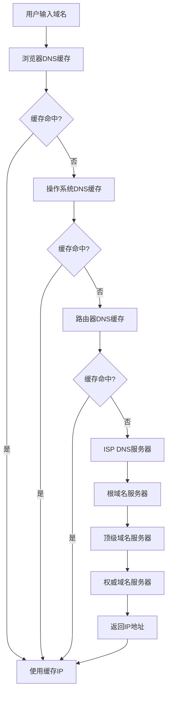

# 浏览器渲染原理：从URL输入到页面展示的完整流程

> 本文档详细解析浏览器从接收URL到最终展示页面内容的完整过程，涵盖网络通信、资源解析、DOM构建、样式计算、布局绘制等关键环节。

## 📋 目录

1. [概述](#概述)
2. [URL解析阶段](#url解析阶段)
3. [DNS域名解析](#dns域名解析)
4. [建立网络连接](#建立网络连接)
5. [HTTP请求与响应](#http请求与响应)
6. [资源解析处理](#资源解析处理)
7. [DOM树构建](#dom树构建)
8. [CSS解析与CSSOM](#css解析与cssom)
9. [布局计算Layout](#布局计算layout)
10. [绘制阶段Paint](#绘制阶段paint)
11. [合成阶段Composite](#合成阶段composite)
12. [JavaScript执行](#javascript执行)
13. [性能优化策略](#性能优化策略)
14. [时间线分析](#时间线分析)

---

## 概述

当用户在浏览器地址栏输入URL并按下回车键时，浏览器会启动一个复杂的处理流程，涉及网络通信、资源解析、页面渲染等多个阶段。整个过程可以分为以下主要步骤：

```
用户输入URL → URL解析 → DNS解析 → 建立连接 → 发送请求 → 接收响应 
→ 解析HTML → 构建DOM → 解析CSS → 样式计算 → 布局计算 → 绘制 → 合成 → 显示页面
```

---

## URL解析阶段

### 1.1 URL格式解析

浏览器首先需要解析用户输入的URL，提取各个组成部分：

```javascript
// URL解析示例
const inputUrl = "https://www.example.com:443/path/page?query=value#fragment";

// 浏览器解析结果
const parsedUrl = {
  protocol: "https:",           // 协议类型
  hostname: "www.example.com",  // 主机名
  port: "443",                 // 端口号（HTTPS默认443，HTTP默认80）
  pathname: "/path/page",       // 路径
  search: "?query=value",       // 查询参数
  hash: "#fragment"            // 锚点/片段标识符
};
```

### 1.2 URL补全与验证

```javascript
// 浏览器自动补全逻辑
const urlCompletion = {
  // 补全协议
  addProtocol: (url) => {
    if (!url.startsWith('http://') && !url.startsWith('https://')) {
      return 'https://' + url; // 现代浏览器默认使用HTTPS
    }
    return url;
  },
  
  // 补全端口
  addDefaultPort: (protocol) => {
    return {
      'http:': '80',
      'https:': '443',
      'ftp:': '21'
    }[protocol];
  },
  
  // 验证URL有效性
  validate: (url) => {
    try {
      new URL(url);
      return true;
    } catch (error) {
      return false;
    }
  }
};
```

---

## DNS域名解析

### 2.1 DNS查询流程

DNS解析是将域名转换为IP地址的过程，采用分层查询机制：



### 2.2 DNS解析实现细节

```javascript
// DNS解析过程模拟
const dnsResolver = {
  // 1. 检查浏览器缓存
  checkBrowserCache: (domain) => {
    const cache = browser.dnsCache.get(domain);
    if (cache && !cache.isExpired()) {
      return cache.ip;
    }
    return null;
  },
  
  // 2. 检查操作系统缓存
  checkOSCache: (domain) => {
    // 检查 /etc/hosts 文件（Linux/Mac）或 hosts 文件（Windows）
    const hostsFile = os.readHostsFile();
    return hostsFile[domain] || null;
  },
  
  // 3. 递归DNS查询
  recursiveQuery: async (domain) => {
    // 根服务器查询
    const rootServers = ['198.41.0.4', '199.9.14.201']; // 根服务器IP
    
    // 查询顶级域名服务器
    const tldResult = await queryDNS(rootServers, domain);
    
    // 查询权威域名服务器
    const authResult = await queryDNS(tldResult.nameservers, domain);
    
    return authResult.ip;
  },
  
  // DNS查询优化
  optimizations: {
    // DNS预解析
    prefetch: (domains) => {
      domains.forEach(domain => {
        // <link rel="dns-prefetch" href="//example.com">
        dnsResolver.resolve(domain);
      });
    },
    
    // DNS缓存策略
    cacheStrategy: {
      browserCache: '1分钟',
      osCache: '5分钟',
      routerCache: '30分钟'
    }
  }
};
```

### 2.3 DNS优化技术

```html
<!-- DNS优化示例 -->
<!DOCTYPE html>
<html>
<head>
  <!-- DNS预解析 - 提前解析第三方域名 -->
  <link rel="dns-prefetch" href="//fonts.googleapis.com">
  <link rel="dns-prefetch" href="//api.example.com">
  <link rel="dns-prefetch" href="//cdn.jsdelivr.net">
  
  <!-- 预连接 - 不仅解析DNS，还建立TCP连接 -->
  <link rel="preconnect" href="//fonts.gstatic.com" crossorigin>
</head>
</html>
```

---

## 建立网络连接

### 3.1 TCP三次握手

建立可靠的TCP连接需要三次握手过程：

```javascript
// TCP连接建立过程
const tcpConnection = {
  // 第一次握手：客户端发送SYN
  step1: {
    from: '客户端',
    to: '服务器',
    packet: 'SYN',
    description: '请求建立连接',
    sequenceNumber: 'x'
  },
  
  // 第二次握手：服务器回应SYN+ACK
  step2: {
    from: '服务器',
    to: '客户端',
    packet: 'SYN+ACK',
    description: '确认连接请求并请求客户端确认',
    sequenceNumber: 'y',
    acknowledgmentNumber: 'x+1'
  },
  
  // 第三次握手：客户端发送ACK
  step3: {
    from: '客户端',
    to: '服务器',
    packet: 'ACK',
    description: '确认连接建立',
    acknowledgmentNumber: 'y+1'
  }
};

// 连接状态管理
const connectionState = {
  CLOSED: '连接关闭',
  LISTEN: '服务器监听',
  SYN_SENT: '客户端发送SYN',
  SYN_RCVD: '服务器接收SYN',
  ESTABLISHED: '连接建立'
};
```

### 3.2 HTTPS的TLS握手

对于HTTPS连接，还需要进行TLS握手来建立加密通道：

```javascript
// TLS握手过程
const tlsHandshake = {
  // 1. Client Hello
  clientHello: {
    tlsVersion: 'TLS 1.3',
    cipherSuites: [
      'TLS_AES_256_GCM_SHA384',
      'TLS_CHACHA20_POLY1305_SHA256',
      'TLS_AES_128_GCM_SHA256'
    ],
    randomBytes: 'client_random_32_bytes',
    sessionId: 'optional_session_id'
  },
  
  // 2. Server Hello + Certificate
  serverHello: {
    selectedCipher: 'TLS_AES_256_GCM_SHA384',
    certificate: {
      domain: 'www.example.com',
      issuer: 'Let\'s Encrypt Authority',
      publicKey: 'server_public_key',
      signature: 'ca_signature'
    },
    randomBytes: 'server_random_32_bytes'
  },
  
  // 3. 证书验证
  certificateVerification: {
    checkDomain: (cert, hostname) => cert.domain === hostname,
    checkIssuer: (cert) => trustedCAs.includes(cert.issuer),
    checkExpiry: (cert) => new Date() < cert.expiryDate,
    checkRevocation: (cert) => !isRevoked(cert.serialNumber)
  },
  
  // 4. 密钥交换
  keyExchange: {
    preSharedKey: 'generated_from_random_values',
    masterSecret: 'derived_from_psk_and_handshake_messages',
    sessionKeys: {
      clientWriteKey: 'client_encryption_key',
      serverWriteKey: 'server_encryption_key',
      clientMac: 'client_mac_key',
      serverMac: 'server_mac_key'
    }
  }
};
```

### 3.3 连接优化策略

```javascript
// 连接优化技术
const connectionOptimizations = {
  // HTTP/2 连接复用
  http2Multiplexing: {
    description: '单个连接支持多个并行请求',
    benefits: ['减少连接开销', '避免队头阻塞', '服务器推送'],
    implementation: 'ALPN协商升级到HTTP/2'
  },
  
  // Keep-Alive 连接保持
  keepAlive: {
    headers: {
      'Connection': 'keep-alive',
      'Keep-Alive': 'timeout=5, max=1000'
    },
    benefits: '避免重复建立TCP连接'
  },
  
  // 连接预热
  preconnect: {
    html: '<link rel="preconnect" href="//api.example.com">',
    description: '提前建立到关键域名的连接'
  }
};
```

---

## HTTP请求与响应

### 4.1 构造HTTP请求

浏览器根据解析的URL信息构造HTTP请求：

```http
GET /api/users?page=1&limit=10 HTTP/1.1
Host: api.example.com
User-Agent: Mozilla/5.0 (Windows NT 10.0; Win64; x64) AppleWebKit/537.36 (KHTML, like Gecko) Chrome/120.0.0.0 Safari/537.36
Accept: text/html,application/xhtml+xml,application/xml;q=0.9,image/webp,*/*;q=0.8
Accept-Language: zh-CN,zh;q=0.9,en;q=0.8
Accept-Encoding: gzip, deflate, br
Connection: keep-alive
Cache-Control: no-cache
Pragma: no-cache
Upgrade-Insecure-Requests: 1
Sec-Fetch-Dest: document
Sec-Fetch-Mode: navigate
Sec-Fetch-Site: none
```

### 4.2 HTTP请求头详解

```javascript
// 关键请求头解析
const httpHeaders = {
  // 必需头部
  required: {
    'Host': 'api.example.com',  // 目标主机，HTTP/1.1必需
    'User-Agent': 'browser_identification_string'  // 浏览器标识
  },
  
  // 内容协商
  contentNegotiation: {
    'Accept': 'text/html,application/xml;q=0.9,*/*;q=0.8',  // 接受的内容类型
    'Accept-Language': 'zh-CN,zh;q=0.9,en;q=0.8',  // 接受的语言
    'Accept-Encoding': 'gzip, deflate, br',  // 接受的编码方式
    'Accept-Charset': 'utf-8, iso-8859-1;q=0.8'  // 接受的字符集
  },
  
  // 缓存控制
  caching: {
    'Cache-Control': 'no-cache, max-age=0',  // 缓存策略
    'If-Modified-Since': 'Wed, 21 Oct 2023 07:28:00 GMT',  // 条件请求
    'If-None-Match': '"686897696a7c876b7e"',  // ETag条件请求
    'Pragma': 'no-cache'  // HTTP/1.0兼容
  },
  
  // 安全相关
  security: {
    'Sec-Fetch-Dest': 'document',  // 请求目标类型
    'Sec-Fetch-Mode': 'navigate',  // 请求模式
    'Sec-Fetch-Site': 'cross-site',  // 请求来源
    'Upgrade-Insecure-Requests': '1'  // 升级到HTTPS
  }
};
```

### 4.3 服务器处理与响应

```javascript
// 服务器端处理流程
const serverProcessing = {
  // 1. 请求解析
  parseRequest: (rawRequest) => {
    const lines = rawRequest.split('\r\n');
    const [method, path, version] = lines[0].split(' ');
    
    const headers = {};
    let bodyStart = 1;
    
    for (let i = 1; i < lines.length; i++) {
      if (lines[i] === '') {
        bodyStart = i + 1;
        break;
      }
      const [key, value] = lines[i].split(': ');
      headers[key.toLowerCase()] = value;
    }
    
    return { method, path, version, headers, body: lines.slice(bodyStart) };
  },
  
  // 2. 路由匹配
  routeMatching: (path) => {
    const routes = {
      '/': 'indexHandler',
      '/api/users': 'usersHandler',
      '/static/*': 'staticHandler'
    };
    
    return routes[path] || routes['/static/*'] || 'notFoundHandler';
  },
  
  // 3. 中间件处理
  middleware: [
    'authenticationMiddleware',
    'corsMiddleware', 
    'rateLimitMiddleware',
    'loggingMiddleware'
  ],
  
  // 4. 业务逻辑处理
  businessLogic: async (request) => {
    // 数据库查询、业务计算、第三方API调用等
    const data = await database.query(request.params);
    return processBusinessRules(data);
  },
  
  // 5. 响应生成
  generateResponse: (data) => {
    return {
      status: 200,
      headers: {
        'Content-Type': 'text/html; charset=utf-8',
        'Content-Length': data.length.toString(),
        'Cache-Control': 'public, max-age=3600',
        'Last-Modified': new Date().toUTCString(),
        'ETag': generateETag(data)
      },
      body: data
    };
  }
};
```

### 4.4 HTTP响应解析

```http
HTTP/1.1 200 OK
Date: Thu, 14 Dec 2023 12:00:00 GMT
Server: nginx/1.20.1
Content-Type: text/html; charset=utf-8
Content-Length: 15423
Content-Encoding: gzip
Cache-Control: public, max-age=3600
Last-Modified: Wed, 13 Dec 2023 10:30:00 GMT
ETag: "686897696a7c876b7e"
Vary: Accept-Encoding
X-Frame-Options: SAMEORIGIN
X-Content-Type-Options: nosniff
X-XSS-Protection: 1; mode=block

<!DOCTYPE html>
<html lang="zh-CN">
<head>
    <meta charset="UTF-8">
    <meta name="viewport" content="width=device-width, initial-scale=1.0">
    <title>示例页面</title>
    <link rel="stylesheet" href="/css/styles.css">
</head>
<body>
    <header>
        <h1>欢迎访问示例网站</h1>
    </header>
    <main>
        <p>这是页面的主要内容。</p>
    </main>
    <script src="/js/app.js"></script>
</body>
</html>
```

---

## 资源解析处理

### 5.1 响应数据处理

```javascript
// 响应数据处理流程
const responseProcessor = {
  // 1. 状态码处理
  handleStatusCode: (statusCode) => {
    const handlers = {
      200: 'processSuccess',
      301: 'handleRedirect',
      304: 'useCache',
      404: 'showNotFound',
      500: 'showServerError'
    };
    return handlers[statusCode] || 'handleUnknownStatus';
  },
  
  // 2. 内容解码
  decodeContent: (response) => {
    const encoding = response.headers['content-encoding'];
    
    switch (encoding) {
      case 'gzip':
        return gzip.decompress(response.body);
      case 'deflate':
        return deflate.decompress(response.body);
      case 'br':
        return brotli.decompress(response.body);
      default:
        return response.body;
    }
  },
  
  // 3. 字符集转换
  decodeCharset: (content, contentType) => {
    const charset = contentType.match(/charset=([^;]+)/)?.[1] || 'utf-8';
    
    if (charset.toLowerCase() !== 'utf-8') {
      return iconv.decode(content, charset);
    }
    return content;
  },
  
  // 4. MIME类型处理
  processMimeType: (contentType, content) => {
    const mimeHandlers = {
      'text/html': 'parseHTML',
      'text/css': 'parseCSS',
      'application/javascript': 'parseJavaScript',
      'application/json': 'parseJSON',
      'image/jpeg': 'decodeImage',
      'image/png': 'decodeImage'
    };
    
    const handler = mimeHandlers[contentType.split(';')[0]];
    return handler ? this[handler](content) : content;
  }
};
```

### 5.2 缓存机制

```javascript
// 浏览器缓存策略
const cacheStrategy = {
  // 强缓存检查
  checkStrongCache: (url) => {
    const cached = browser.cache.get(url);
    
    if (!cached) return null;
    
    // 检查 Cache-Control
    const cacheControl = cached.headers['cache-control'];
    if (cacheControl) {
      const maxAge = cacheControl.match(/max-age=(\d+)/)?.[1];
      if (maxAge) {
        const age = (Date.now() - cached.timestamp) / 1000;
        if (age < parseInt(maxAge)) {
          return cached; // 命中强缓存
        }
      }
    }
    
    // 检查 Expires
    const expires = cached.headers['expires'];
    if (expires && new Date(expires) > new Date()) {
      return cached; // 命中强缓存
    }
    
    return null;
  },
  
  // 协商缓存
  negotiateCache: (url, cached) => {
    const headers = {};
    
    // Last-Modified 协商
    if (cached.headers['last-modified']) {
      headers['If-Modified-Since'] = cached.headers['last-modified'];
    }
    
    // ETag 协商
    if (cached.headers['etag']) {
      headers['If-None-Match'] = cached.headers['etag'];
    }
    
    return headers;
  },
  
  // 缓存存储策略
  storageStrategy: {
    memory: {
      description: '内存缓存，最快但容量有限',
      size: '100MB',
      duration: '会话期间'
    },
    disk: {
      description: '磁盘缓存，容量大但速度较慢',
      size: '1GB',
      duration: '持久化存储'
    },
    serviceWorker: {
      description: 'Service Worker缓存，可编程控制',
      size: '可配置',
      duration: '可编程控制'
    }
  }
};
```

---

## DOM树构建

### 6.1 HTML词法分析

```javascript
// HTML tokenizer - 词法分析器
const htmlTokenizer = {
  // Token类型定义
  TokenType: {
    START_TAG: 'StartTag',      // <div>
    END_TAG: 'EndTag',          // </div>
    TEXT: 'Text',               // 文本内容
    COMMENT: 'Comment',         // <!-- 注释 -->
    DOCTYPE: 'DOCTYPE',         // <!DOCTYPE html>
    ATTRIBUTE: 'Attribute'      // class="container"
  },
  
  // 分词过程
  tokenize: (html) => {
    const tokens = [];
    let position = 0;
    
    while (position < html.length) {
      const char = html[position];
      
      if (char === '<') {
        // 处理标签
        if (html[position + 1] === '/') {
          tokens.push(this.parseEndTag(html, position));
        } else if (html.substr(position, 4) === '<!--') {
          tokens.push(this.parseComment(html, position));
        } else if (html.substr(position, 9) === '<!DOCTYPE') {
          tokens.push(this.parseDoctype(html, position));
        } else {
          tokens.push(this.parseStartTag(html, position));
        }
      } else {
        // 处理文本内容
        tokens.push(this.parseText(html, position));
      }
    }
    
    return tokens;
  },
  
  // 解析开始标签
  parseStartTag: (html, start) => {
    const match = html.substr(start).match(/^<(\w+)([^>]*)>/);
    if (!match) return null;
    
    const [fullMatch, tagName, attributesStr] = match;
    
    return {
      type: 'StartTag',
      tagName: tagName.toLowerCase(),
      attributes: this.parseAttributes(attributesStr),
      selfClosing: attributesStr.includes('/'),
      position: start,
      length: fullMatch.length
    };
  },
  
  // 解析属性
  parseAttributes: (attributesStr) => {
    const attributes = {};
    const attrRegex = /(\w+)(?:\s*=\s*["']([^"']*)["'])?/g;
    let match;
    
    while ((match = attrRegex.exec(attributesStr)) !== null) {
      const [, name, value] = match;
      attributes[name.toLowerCase()] = value || '';
    }
    
    return attributes;
  }
};
```

### 6.2 DOM树构建算法

```javascript
// DOM树构建器
const domBuilder = {
  // 构建DOM树
  buildTree: (tokens) => {
    const root = {
      nodeType: 'Document',
      children: []
    };
    
    const stack = [root];
    
    for (const token of tokens) {
      switch (token.type) {
        case 'StartTag':
          this.handleStartTag(token, stack);
          break;
        case 'EndTag':
          this.handleEndTag(token, stack);
          break;
        case 'Text':
          this.handleText(token, stack);
          break;
        case 'Comment':
          this.handleComment(token, stack);
          break;
      }
    }
    
    return root;
  },
  
  // 处理开始标签
  handleStartTag: (token, stack) => {
    const element = {
      nodeType: 'Element',
      tagName: token.tagName,
      attributes: token.attributes,
      children: [],
      parent: stack[stack.length - 1]
    };
    
    // 添加到父元素
    stack[stack.length - 1].children.push(element);
    
    // 非自闭合标签入栈
    if (!token.selfClosing && !this.isVoidElement(token.tagName)) {
      stack.push(element);
    }
  },
  
  // 处理结束标签
  handleEndTag: (token, stack) => {
    // 找到匹配的开始标签并出栈
    for (let i = stack.length - 1; i >= 0; i--) {
      if (stack[i].tagName === token.tagName) {
        stack.splice(i);
        break;
      }
    }
  },
  
  // 处理文本节点
  handleText: (token, stack) => {
    const textNode = {
      nodeType: 'Text',
      textContent: token.content,
      parent: stack[stack.length - 1]
    };
    
    stack[stack.length - 1].children.push(textNode);
  },
  
  // 空元素列表（自闭合）
  voidElements: new Set([
    'area', 'base', 'br', 'col', 'embed', 'hr', 'img', 
    'input', 'keygen', 'link', 'meta', 'param', 'source', 
    'track', 'wbr'
  ]),
  
  isVoidElement: (tagName) => {
    return this.voidElements.has(tagName);
  }
};
```

### 6.3 特殊元素处理

```javascript
// 特殊元素处理逻辑
const specialElementHandler = {
  // Script标签处理
  handleScript: (element) => {
    if (element.tagName === 'script') {
      // 检查是否为外部脚本
      if (element.attributes.src) {
        // 暂停HTML解析，加载外部脚本
        this.pauseHTMLParsing();
        this.loadExternalScript(element.attributes.src)
          .then(() => {
            this.resumeHTMLParsing();
          });
      } else {
        // 内联脚本立即执行
        this.executeInlineScript(element.textContent);
      }
    }
  },
  
  // Style标签处理
  handleStyle: (element) => {
    if (element.tagName === 'style') {
      // 解析内联CSS
      const cssRules = cssParser.parse(element.textContent);
      cssom.addRules(cssRules);
    }
  },
  
  // Link标签处理
  handleLink: (element) => {
    if (element.tagName === 'link') {
      const rel = element.attributes.rel;
      
      switch (rel) {
        case 'stylesheet':
          // 加载外部CSS
          this.loadExternalStylesheet(element.attributes.href);
          break;
        case 'dns-prefetch':
          // DNS预解析
          this.prefetchDNS(element.attributes.href);
          break;
        case 'preload':
          // 资源预加载
          this.preloadResource(element.attributes.href, element.attributes.as);
          break;
      }
    }
  },
  
  // Meta标签处理
  handleMeta: (element) => {
    if (element.tagName === 'meta') {
      const name = element.attributes.name;
      const content = element.attributes.content;
      
      if (name === 'viewport') {
        // 设置视口
        this.setViewport(content);
      } else if (element.attributes.charset) {
        // 设置字符编码
        this.setCharset(element.attributes.charset);
      }
    }
  }
};
```

---

## CSS解析与CSSOM

### 7.1 CSS词法分析

```javascript
// CSS tokenizer
const cssTokenizer = {
  // CSS Token类型
  TokenType: {
    SELECTOR: 'Selector',
    PROPERTY: 'Property',
    VALUE: 'Value',
    AT_RULE: 'AtRule',
    COMMENT: 'Comment'
  },
  
  // CSS分词
  tokenize: (css) => {
    const tokens = [];
    let position = 0;
    
    // 去除注释
    css = this.removeComments(css);
    
    while (position < css.length) {
      const char = css[position];
      
      if (char === '@') {
        // 处理@规则
        tokens.push(this.parseAtRule(css, position));
      } else if (char === '{') {
        // 开始属性块
        tokens.push({ type: 'BlockStart', position });
      } else if (char === '}') {
        // 结束属性块
        tokens.push({ type: 'BlockEnd', position });
      } else if (!this.isWhitespace(char)) {
        // 解析选择器或属性
        tokens.push(this.parseSelector(css, position));
      }
      
      position++;
    }
    
    return tokens;
  },
  
  // 解析选择器
  parseSelector: (css, start) => {
    const match = css.substr(start).match(/^([^{]+)/);
    if (!match) return null;
    
    return {
      type: 'Selector',
      value: match[1].trim(),
      position: start,
      length: match[1].length
    };
  },
  
  // 去除注释
  removeComments: (css) => {
    return css.replace(/\/\*[\s\S]*?\*\//g, '');
  }
};
```

### 7.2 CSSOM构建

```javascript
// CSSOM构建器
const cssomBuilder = {
  // 构建CSSOM树
  buildCSSOM: (cssText) => {
    const rules = this.parseRules(cssText);
    
    const cssom = {
      rules: [],
      styleSheets: []
    };
    
    rules.forEach(rule => {
      if (rule.type === 'style') {
        cssom.rules.push(this.createStyleRule(rule));
      } else if (rule.type === 'media') {
        cssom.rules.push(this.createMediaRule(rule));
      } else if (rule.type === 'keyframes') {
        cssom.rules.push(this.createKeyframesRule(rule));
      }
    });
    
    return cssom;
  },
  
  // 创建样式规则
  createStyleRule: (rule) => {
    return {
      type: 'CSSStyleRule',
      selectorText: rule.selector,
      style: this.parseDeclarations(rule.declarations),
      specificity: this.calculateSpecificity(rule.selector)
    };
  },
  
  // 解析CSS声明
  parseDeclarations: (declarationsText) => {
    const declarations = {};
    const declRegex = /([^:]+):\s*([^;]+)/g;
    let match;
    
    while ((match = declRegex.exec(declarationsText)) !== null) {
      const [, property, value] = match;
      declarations[property.trim()] = value.trim();
    }
    
    return declarations;
  },
  
  // 计算选择器特异性
  calculateSpecificity: (selector) => {
    let a = 0; // 内联样式
    let b = 0; // ID选择器
    let c = 0; // 类选择器、属性选择器、伪类
    let d = 0; // 元素选择器、伪元素
    
    // ID选择器
    const ids = selector.match(/#[\w-]+/g);
    if (ids) b += ids.length;
    
    // 类选择器
    const classes = selector.match(/\.[\w-]+/g);
    if (classes) c += classes.length;
    
    // 属性选择器
    const attributes = selector.match(/\[[^\]]+\]/g);
    if (attributes) c += attributes.length;
    
    // 伪类
    const pseudoClasses = selector.match(/:[\w-]+(?:\([^)]*\))?/g);
    if (pseudoClasses) c += pseudoClasses.length;
    
    // 元素选择器
    const elements = selector.match(/\b[a-z][\w-]*/g);
    if (elements) d += elements.length;
    
    return { a, b, c, d, value: a * 1000 + b * 100 + c * 10 + d };
  }
};
```

### 7.3 样式计算

```javascript
// 样式计算引擎
const styleEngine = {
  // 计算元素的最终样式
  computeStyles: (element, cssom) => {
    const matchedRules = this.matchRules(element, cssom.rules);
    const computedStyle = this.cascadeAndInherit(element, matchedRules);
    
    return computedStyle;
  },
  
  // 匹配CSS规则
  matchRules: (element, rules) => {
    const matched = [];
    
    rules.forEach(rule => {
      if (this.selectorMatches(element, rule.selectorText)) {
        matched.push({
          rule: rule,
          specificity: rule.specificity
        });
      }
    });
    
    // 按特异性排序
    matched.sort((a, b) => b.specificity.value - a.specificity.value);
    
    return matched;
  },
  
  // 选择器匹配
  selectorMatches: (element, selector) => {
    // 简化的选择器匹配算法
    if (selector.startsWith('#')) {
      // ID选择器
      return element.attributes.id === selector.slice(1);
    } else if (selector.startsWith('.')) {
      // 类选择器
      const className = selector.slice(1);
      const elementClasses = (element.attributes.class || '').split(' ');
      return elementClasses.includes(className);
    } else {
      // 标签选择器
      return element.tagName === selector;
    }
  },
  
  // 层叠和继承
  cascadeAndInherit: (element, matchedRules) => {
    const computedStyle = {};
    
    // 1. 浏览器默认样式
    Object.assign(computedStyle, this.getDefaultStyles(element.tagName));
    
    // 2. 继承的样式
    if (element.parent) {
      Object.assign(computedStyle, this.getInheritedStyles(element.parent.computedStyle));
    }
    
    // 3. 应用匹配的CSS规则
    matchedRules.forEach(({ rule }) => {
      Object.assign(computedStyle, rule.style);
    });
    
    // 4. 内联样式（最高优先级）
    if (element.attributes.style) {
      const inlineStyles = this.parseInlineStyles(element.attributes.style);
      Object.assign(computedStyle, inlineStyles);
    }
    
    return computedStyle;
  },
  
  // 可继承的CSS属性
  inheritableProperties: new Set([
    'color', 'font-family', 'font-size', 'font-weight', 'line-height',
    'text-align', 'text-indent', 'letter-spacing', 'word-spacing',
    'white-space', 'direction', 'visibility'
  ]),
  
  // 获取继承的样式
  getInheritedStyles: (parentStyle) => {
    const inherited = {};
    
    for (const [property, value] of Object.entries(parentStyle)) {
      if (this.inheritableProperties.has(property)) {
        inherited[property] = value;
      }
    }
    
    return inherited;
  }
};
```

---

## 布局计算Layout

### 8.1 布局树构建

```javascript
// 布局树构建器
const layoutTreeBuilder = {
  // 构建布局树
  buildLayoutTree: (domTree, cssom) => {
    const layoutTree = [];
    
    this.traverseDOM(domTree, (element) => {
      const computedStyle = styleEngine.computeStyles(element, cssom);
      element.computedStyle = computedStyle;
      
      // 跳过不渲染的元素
      if (computedStyle.display === 'none') {
        return;
      }
      
      const layoutObject = this.createLayoutObject(element, computedStyle);
      layoutTree.push(layoutObject);
    });
    
    return layoutTree;
  },
  
  // 创建布局对象
  createLayoutObject: (element, computedStyle) => {
    return {
      element: element,
      style: computedStyle,
      geometry: {
        x: 0,
        y: 0,
        width: 0,
        height: 0,
        marginTop: 0,
        marginRight: 0,
        marginBottom: 0,
        marginLeft: 0,
        paddingTop: 0,
        paddingRight: 0,
        paddingBottom: 0,
        paddingLeft: 0,
        borderTopWidth: 0,
        borderRightWidth: 0,
        borderBottomWidth: 0,
        borderLeftWidth: 0
      },
      children: []
    };
  },
  
  // 遍历DOM树
  traverseDOM: (node, callback) => {
    if (node.nodeType === 'Element') {
      callback(node);
    }
    
    if (node.children) {
      node.children.forEach(child => {
        this.traverseDOM(child, callback);
      });
    }
  }
};
```

### 8.2 布局计算算法

```javascript
// 布局计算引擎
const layoutEngine = {
  // 执行布局计算
  calculateLayout: (layoutTree, viewport) => {
    // 建立包含块链
    this.establishContainingBlocks(layoutTree);
    
    // 计算每个元素的几何信息
    layoutTree.forEach(layoutObject => {
      this.calculateGeometry(layoutObject, viewport);
    });
  },
  
  // 计算元素几何信息
  calculateGeometry: (layoutObject, containingBlock) => {
    const style = layoutObject.style;
    const geometry = layoutObject.geometry;
    
    // 1. 计算盒模型尺寸
    this.calculateBoxModel(layoutObject, containingBlock);
    
    // 2. 根据display类型计算布局
    switch (style.display) {
      case 'block':
        this.calculateBlockLayout(layoutObject, containingBlock);
        break;
      case 'inline':
        this.calculateInlineLayout(layoutObject, containingBlock);
        break;
      case 'flex':
        this.calculateFlexLayout(layoutObject, containingBlock);
        break;
      case 'grid':
        this.calculateGridLayout(layoutObject, containingBlock);
        break;
    }
  },
  
  // 计算盒模型
  calculateBoxModel: (layoutObject, containingBlock) => {
    const style = layoutObject.style;
    const geometry = layoutObject.geometry;
    
    // 解析边距
    geometry.marginTop = this.parseLength(style.marginTop, containingBlock.height);
    geometry.marginRight = this.parseLength(style.marginRight, containingBlock.width);
    geometry.marginBottom = this.parseLength(style.marginBottom, containingBlock.height);
    geometry.marginLeft = this.parseLength(style.marginLeft, containingBlock.width);
    
    // 解析内边距
    geometry.paddingTop = this.parseLength(style.paddingTop, containingBlock.height);
    geometry.paddingRight = this.parseLength(style.paddingRight, containingBlock.width);
    geometry.paddingBottom = this.parseLength(style.paddingBottom, containingBlock.height);
    geometry.paddingLeft = this.parseLength(style.paddingLeft, containingBlock.width);
    
    // 解析边框
    geometry.borderTopWidth = this.parseLength(style.borderTopWidth, 0);
    geometry.borderRightWidth = this.parseLength(style.borderRightWidth, 0);
    geometry.borderBottomWidth = this.parseLength(style.borderBottomWidth, 0);
    geometry.borderLeftWidth = this.parseLength(style.borderLeftWidth, 0);
  },
  
  // 块级布局
  calculateBlockLayout: (layoutObject, containingBlock) => {
    const style = layoutObject.style;
    const geometry = layoutObject.geometry;
    
    // 宽度计算
    if (style.width === 'auto') {
      geometry.width = containingBlock.width - 
        geometry.marginLeft - geometry.marginRight -
        geometry.paddingLeft - geometry.paddingRight -
        geometry.borderLeftWidth - geometry.borderRightWidth;
    } else {
      geometry.width = this.parseLength(style.width, containingBlock.width);
    }
    
    // 高度计算
    if (style.height === 'auto') {
      geometry.height = this.calculateContentHeight(layoutObject);
    } else {
      geometry.height = this.parseLength(style.height, containingBlock.height);
    }
    
    // 位置计算
    geometry.x = containingBlock.x + geometry.marginLeft;
    geometry.y = this.calculateVerticalPosition(layoutObject, containingBlock);
  },
  
  // Flexbox布局
  calculateFlexLayout: (layoutObject, containingBlock) => {
    const style = layoutObject.style;
    const children = layoutObject.children;
    
    // 确定主轴和交叉轴
    const isRowDirection = style.flexDirection === 'row' || style.flexDirection === 'row-reverse';
    const mainAxis = isRowDirection ? 'width' : 'height';
    const crossAxis = isRowDirection ? 'height' : 'width';
    
    // 计算主轴可用空间
    const mainAxisSize = isRowDirection ? containingBlock.width : containingBlock.height;
    let usedMainAxisSpace = 0;
    
    // 第一轮：计算固定尺寸的项目
    children.forEach(child => {
      if (child.style[mainAxis] !== 'auto') {
        child.geometry[mainAxis] = this.parseLength(child.style[mainAxis], mainAxisSize);
        usedMainAxisSpace += child.geometry[mainAxis];
      }
    });
    
    // 第二轮：分配剩余空间给flex项目
    const remainingSpace = mainAxisSize - usedMainAxisSpace;
    const flexGrowSum = children.reduce((sum, child) => sum + (parseFloat(child.style.flexGrow) || 0), 0);
    
    if (flexGrowSum > 0) {
      children.forEach(child => {
        const flexGrow = parseFloat(child.style.flexGrow) || 0;
        if (flexGrow > 0) {
          child.geometry[mainAxis] += (remainingSpace * flexGrow) / flexGrowSum;
        }
      });
    }
    
    // 第三轮：定位flex项目
    let currentPosition = 0;
    children.forEach(child => {
      if (isRowDirection) {
        child.geometry.x = containingBlock.x + currentPosition;
        child.geometry.y = containingBlock.y;
        currentPosition += child.geometry.width;
      } else {
        child.geometry.x = containingBlock.x;
        child.geometry.y = containingBlock.y + currentPosition;
        currentPosition += child.geometry.height;
      }
    });
  },
  
  // 解析长度值
  parseLength: (value, referenceValue) => {
    if (typeof value === 'number') return value;
    if (typeof value !== 'string') return 0;
    
    if (value.endsWith('px')) {
      return parseFloat(value);
    } else if (value.endsWith('%')) {
      return (parseFloat(value) / 100) * referenceValue;
    } else if (value.endsWith('em')) {
      return parseFloat(value) * 16; // 简化处理，假设1em=16px
    } else if (value.endsWith('rem')) {
      return parseFloat(value) * 16; // 简化处理，假设1rem=16px
    } else if (value === 'auto') {
      return 'auto';
    }
    
    return 0;
  }
};
```

### 8.3 布局优化

```javascript
// 布局优化策略
const layoutOptimizations = {
  // 增量布局
  incrementalLayout: {
    description: '只重新计算受影响的元素',
    implementation: (changedElements) => {
      const affectedElements = this.findAffectedElements(changedElements);
      affectedElements.forEach(element => {
        layoutEngine.calculateGeometry(element);
      });
    }
  },
  
  // 布局缓存
  layoutCache: {
    cache: new Map(),
    
    get: (element, containingBlock) => {
      const key = this.generateCacheKey(element, containingBlock);
      return this.cache.get(key);
    },
    
    set: (element, containingBlock, geometry) => {
      const key = this.generateCacheKey(element, containingBlock);
      this.cache.set(key, geometry);
    },
    
    generateCacheKey: (element, containingBlock) => {
      return `${element.id}_${containingBlock.width}_${containingBlock.height}`;
    }
  },
  
  // 延迟布局
  deferredLayout: {
    scheduledElements: new Set(),
    
    schedule: (element) => {
      this.scheduledElements.add(element);
      requestAnimationFrame(() => {
        this.flush();
      });
    },
    
    flush: () => {
      this.scheduledElements.forEach(element => {
        layoutEngine.calculateGeometry(element);
      });
      this.scheduledElements.clear();
    }
  }
};
```

---

## 绘制阶段Paint

### 9.1 绘制列表生成

```javascript
// 绘制列表生成器
const paintListGenerator = {
  // 生成绘制指令列表
  generatePaintList: (layoutTree) => {
    const paintList = [];
    
    // 按照绘制顺序遍历元素
    this.traverseInPaintOrder(layoutTree, (layoutObject) => {
      const instructions = this.generatePaintInstructions(layoutObject);
      paintList.push(...instructions);
    });
    
    return paintList;
  },
  
  // 按绘制顺序遍历
  traverseInPaintOrder: (layoutTree, callback) => {
    // 根据z-index和文档顺序排序
    const sortedElements = this.sortByPaintOrder(layoutTree);
    
    sortedElements.forEach(element => {
      callback(element);
    });
  },
  
  // 生成单个元素的绘制指令
  generatePaintInstructions: (layoutObject) => {
    const instructions = [];
    const style = layoutObject.style;
    const geometry = layoutObject.geometry;
    
    // 1. 绘制背景
    if (style.backgroundColor && style.backgroundColor !== 'transparent') {
      instructions.push({
        type: 'fillRect',
        x: geometry.x,
        y: geometry.y,
        width: geometry.width,
        height: geometry.height,
        color: style.backgroundColor
      });
    }
    
    // 2. 绘制背景图片
    if (style.backgroundImage && style.backgroundImage !== 'none') {
      instructions.push({
        type: 'drawImage',
        src: this.extractImageUrl(style.backgroundImage),
        x: geometry.x,
        y: geometry.y,
        width: geometry.width,
        height: geometry.height,
        repeat: style.backgroundRepeat,
        position: style.backgroundPosition
      });
    }
    
    // 3. 绘制边框
    if (this.hasBorder(style)) {
      instructions.push(...this.generateBorderInstructions(geometry, style));
    }
    
    // 4. 绘制文本内容
    if (layoutObject.element.nodeType === 'Text') {
      instructions.push({
        type: 'fillText',
        text: layoutObject.element.textContent,
        x: geometry.x,
        y: geometry.y + geometry.height, // 基线位置
        font: this.buildFontString(style),
        color: style.color
      });
    }
    
    // 5. 绘制轮廓
    if (style.outline && style.outline !== 'none') {
      instructions.push(...this.generateOutlineInstructions(geometry, style));
    }
    
    return instructions;
  },
  
  // 生成边框绘制指令
  generateBorderInstructions: (geometry, style) => {
    const instructions = [];
    
    // 上边框
    if (geometry.borderTopWidth > 0) {
      instructions.push({
        type: 'fillRect',
        x: geometry.x,
        y: geometry.y,
        width: geometry.width,
        height: geometry.borderTopWidth,
        color: style.borderTopColor
      });
    }
    
    // 右边框
    if (geometry.borderRightWidth > 0) {
      instructions.push({
        type: 'fillRect',
        x: geometry.x + geometry.width - geometry.borderRightWidth,
        y: geometry.y,
        width: geometry.borderRightWidth,
        height: geometry.height,
        color: style.borderRightColor
      });
    }
    
    // 下边框
    if (geometry.borderBottomWidth > 0) {
      instructions.push({
        type: 'fillRect',
        x: geometry.x,
        y: geometry.y + geometry.height - geometry.borderBottomWidth,
        width: geometry.width,
        height: geometry.borderBottomWidth,
        color: style.borderBottomColor
      });
    }
    
    // 左边框
    if (geometry.borderLeftWidth > 0) {
      instructions.push({
        type: 'fillRect',
        x: geometry.x,
        y: geometry.y,
        width: geometry.borderLeftWidth,
        height: geometry.height,
        color: style.borderLeftColor
      });
    }
    
    return instructions;
  },
  
  // 按绘制顺序排序
  sortByPaintOrder: (elements) => {
    return elements.sort((a, b) => {
      // 1. 比较z-index
      const aZIndex = parseInt(a.style.zIndex) || 0;
      const bZIndex = parseInt(b.style.zIndex) || 0;
      
      if (aZIndex !== bZIndex) {
        return aZIndex - bZIndex;
      }
      
      // 2. 比较文档顺序
      return a.documentOrder - b.documentOrder;
    });
  }
};
```

### 9.2 栅格化处理

```javascript
// 栅格化引擎
const rasterizer = {
  // 栅格化绘制指令
  rasterize: (paintList, viewport) => {
    // 创建画布
    const canvas = this.createCanvas(viewport.width, viewport.height);
    const context = canvas.getContext('2d');
    
    // 执行绘制指令
    paintList.forEach(instruction => {
      this.executeInstruction(context, instruction);
    });
    
    return canvas;
  },
  
  // 执行单个绘制指令
  executeInstruction: (context, instruction) => {
    switch (instruction.type) {
      case 'fillRect':
        this.drawFillRect(context, instruction);
        break;
      case 'drawImage':
        this.drawImage(context, instruction);
        break;
      case 'fillText':
        this.drawText(context, instruction);
        break;
      case 'strokeRect':
        this.drawStrokeRect(context, instruction);
        break;
    }
  },
  
  // 绘制填充矩形
  drawFillRect: (context, instruction) => {
    context.fillStyle = instruction.color;
    context.fillRect(
      instruction.x,
      instruction.y,
      instruction.width,
      instruction.height
    );
  },
  
  // 绘制图片
  drawImage: (context, instruction) => {
    const image = this.loadImage(instruction.src);
    
    if (image.complete) {
      context.drawImage(
        image,
        instruction.x,
        instruction.y,
        instruction.width,
        instruction.height
      );
    } else {
      // 图片未加载完成，加载完成后重新绘制
      image.onload = () => {
        this.scheduleRepaint();
      };
    }
  },
  
  // 绘制文本
  drawText: (context, instruction) => {
    context.font = instruction.font;
    context.fillStyle = instruction.color;
    context.fillText(
      instruction.text,
      instruction.x,
      instruction.y
    );
  },
  
  // 分块栅格化优化
  tileBasedRasterization: {
    tileSize: 256,
    
    rasterizeTiles: (paintList, viewport) => {
      const tiles = this.divideTiles(viewport);
      const rasterizedTiles = [];
      
      tiles.forEach(tile => {
        const tilePaintList = this.filterPaintListForTile(paintList, tile);
        const rasterizedTile = rasterizer.rasterize(tilePaintList, tile);
        rasterizedTiles.push({
          tile: tile,
          canvas: rasterizedTile
        });
      });
      
      return rasterizedTiles;
    },
    
    divideTiles: (viewport) => {
      const tiles = [];
      const { width, height } = viewport;
      
      for (let y = 0; y < height; y += this.tileSize) {
        for (let x = 0; x < width; x += this.tileSize) {
          tiles.push({
            x: x,
            y: y,
            width: Math.min(this.tileSize, width - x),
            height: Math.min(this.tileSize, height - y)
          });
        }
      }
      
      return tiles;
    }
  }
};
```

### 9.3 绘制优化

```javascript
// 绘制优化策略
const paintOptimizations = {
  // 脏矩形检测
  dirtyRectTracking: {
    dirtyRects: [],
    
    addDirtyRect: (rect) => {
      this.dirtyRects.push(rect);
    },
    
    getDirtyRegion: () => {
      if (this.dirtyRects.length === 0) return null;
      
      // 合并脏矩形
      let minX = Infinity, minY = Infinity;
      let maxX = -Infinity, maxY = -Infinity;
      
      this.dirtyRects.forEach(rect => {
        minX = Math.min(minX, rect.x);
        minY = Math.min(minY, rect.y);
        maxX = Math.max(maxX, rect.x + rect.width);
        maxY = Math.max(maxY, rect.y + rect.height);
      });
      
      return {
        x: minX,
        y: minY,
        width: maxX - minX,
        height: maxY - minY
      };
    },
    
    clearDirtyRects: () => {
      this.dirtyRects = [];
    }
  },
  
  // 绘制调用合并
  drawCallBatching: {
    batchedCalls: [],
    
    addDrawCall: (call) => {
      this.batchedCalls.push(call);
    },
    
    flush: (context) => {
      // 按类型分组绘制调用
      const groupedCalls = this.groupByType(this.batchedCalls);
      
      // 批量执行相同类型的绘制
      Object.entries(groupedCalls).forEach(([type, calls]) => {
        this.executeBatch(context, type, calls);
      });
      
      this.batchedCalls = [];
    }
  },
  
  // 离屏渲染
  offscreenRendering: {
    cache: new Map(),
    
    renderToOffscreen: (element) => {
      const cacheKey = this.generateCacheKey(element);
      
      if (this.cache.has(cacheKey)) {
        return this.cache.get(cacheKey);
      }
      
      const offscreenCanvas = this.createOffscreenCanvas(
        element.geometry.width,
        element.geometry.height
      );
      
      const context = offscreenCanvas.getContext('2d');
      this.renderElement(context, element);
      
      this.cache.set(cacheKey, offscreenCanvas);
      return offscreenCanvas;
    }
  }
};
```

---

## 合成阶段Composite

### 10.1 图层创建

```javascript
// 合成层管理器
const compositeLayerManager = {
  // 创建合成层
  createLayers: (layoutTree) => {
    const layers = [];
    
    layoutTree.forEach(layoutObject => {
      if (this.needsCompositeLayer(layoutObject)) {
        const layer = this.createCompositeLayer(layoutObject);
        layers.push(layer);
      }
    });
    
    return layers;
  },
  
  // 判断是否需要创建合成层
  needsCompositeLayer: (layoutObject) => {
    const style = layoutObject.style;
    
    // 根元素
    if (layoutObject.isRoot) return true;
    
    // 3D transform
    if (this.has3DTransform(style)) return true;
    
    // opacity
    if (style.opacity && parseFloat(style.opacity) < 1) return true;
    
    // position: fixed
    if (style.position === 'fixed') return true;
    
    // transform
    if (style.transform && style.transform !== 'none') return true;
    
    // filter
    if (style.filter && style.filter !== 'none') return true;
    
    // will-change
    if (style.willChange && style.willChange !== 'auto') return true;
    
    // video 元素
    if (layoutObject.element.tagName === 'video') return true;
    
    // canvas 元素
    if (layoutObject.element.tagName === 'canvas') return true;
    
    // 覆盖其他合成层的元素
    if (this.overlapsCompositeLayer(layoutObject)) return true;
    
    return false;
  },
  
  // 创建合成层对象
  createCompositeLayer: (layoutObject) => {
    return {
      id: this.generateLayerId(),
      element: layoutObject.element,
      geometry: layoutObject.geometry,
      style: layoutObject.style,
      paintedContent: null,
      transform: this.parseTransform(layoutObject.style.transform),
      opacity: parseFloat(layoutObject.style.opacity) || 1,
      blendMode: layoutObject.style.mixBlendMode || 'normal',
      filters: this.parseFilters(layoutObject.style.filter)
    };
  },
  
  // 解析transform属性
  parseTransform: (transformString) => {
    if (!transformString || transformString === 'none') {
      return { matrix: [1, 0, 0, 1, 0, 0] }; // 单位矩阵
    }
    
    // 简化的transform解析
    const transforms = {
      translateX: 0,
      translateY: 0,
      translateZ: 0,
      scaleX: 1,
      scaleY: 1,
      scaleZ: 1,
      rotateX: 0,
      rotateY: 0,
      rotateZ: 0
    };
    
    // 解析translate
    const translateMatch = transformString.match(/translate\(([^)]+)\)/);
    if (translateMatch) {
      const values = translateMatch[1].split(',').map(v => parseFloat(v.trim()));
      transforms.translateX = values[0] || 0;
      transforms.translateY = values[1] || 0;
    }
    
    // 解析scale
    const scaleMatch = transformString.match(/scale\(([^)]+)\)/);
    if (scaleMatch) {
      const values = scaleMatch[1].split(',').map(v => parseFloat(v.trim()));
      transforms.scaleX = values[0] || 1;
      transforms.scaleY = values[1] || transforms.scaleX;
    }
    
    // 解析rotate
    const rotateMatch = transformString.match(/rotate\(([^)]+)\)/);
    if (rotateMatch) {
      transforms.rotateZ = parseFloat(rotateMatch[1]);
    }
    
    return transforms;
  },
  
  // 检测3D transform
  has3DTransform: (style) => {
    const transform = style.transform;
    if (!transform) return false;
    
    return /translate3d|translateZ|rotateX|rotateY|perspective|transform-style:\s*preserve-3d/.test(transform);
  }
};
```

### 10.2 层合成处理

```javascript
// 合成处理器
const compositor = {
  // 合成所有图层
  composite: (layers, viewport) => {
    // 创建最终的合成画布
    const finalCanvas = this.createCanvas(viewport.width, viewport.height);
    const context = finalCanvas.getContext('2d');
    
    // 按z-order排序图层
    const sortedLayers = this.sortLayersByZOrder(layers);
    
    // 合成每个图层
    sortedLayers.forEach(layer => {
      this.compositeLayer(context, layer);
    });
    
    return finalCanvas;
  },
  
  // 合成单个图层
  compositeLayer: (context, layer) => {
    // 保存当前上下文状态
    context.save();
    
    // 应用变换
    this.applyTransform(context, layer.transform);
    
    // 应用透明度
    context.globalAlpha = layer.opacity;
    
    // 应用混合模式
    context.globalCompositeOperation = layer.blendMode;
    
    // 应用滤镜
    if (layer.filters.length > 0) {
      context.filter = this.buildFilterString(layer.filters);
    }
    
    // 绘制图层内容
    if (layer.paintedContent) {
      context.drawImage(
        layer.paintedContent,
        layer.geometry.x,
        layer.geometry.y
      );
    }
    
    // 恢复上下文状态
    context.restore();
  },
  
  // 应用变换矩阵
  applyTransform: (context, transform) => {
    // 应用平移
    context.translate(transform.translateX, transform.translateY);
    
    // 应用缩放
    context.scale(transform.scaleX, transform.scaleY);
    
    // 应用旋转
    if (transform.rotateZ !== 0) {
      context.rotate(transform.rotateZ * Math.PI / 180);
    }
  },
  
  // 构建滤镜字符串
  buildFilterString: (filters) => {
    return filters.map(filter => {
      switch (filter.type) {
        case 'blur':
          return `blur(${filter.value}px)`;
        case 'brightness':
          return `brightness(${filter.value})`;
        case 'contrast':
          return `contrast(${filter.value})`;
        case 'grayscale':
          return `grayscale(${filter.value})`;
        default:
          return '';
      }
    }).join(' ');
  },
  
  // 按z-order排序图层
  sortLayersByZOrder: (layers) => {
    return layers.sort((a, b) => {
      const aZIndex = parseInt(a.style.zIndex) || 0;
      const bZIndex = parseInt(b.style.zIndex) || 0;
      return aZIndex - bZIndex;
    });
  }
};
```

### 10.3 硬件加速

```javascript
// 硬件加速管理
const hardwareAcceleration = {
  // GPU层管理
  gpuLayerManager: {
    gpuLayers: new Map(),
    
    // 上传到GPU
    uploadToGPU: (layer) => {
      if (this.canUseGPU(layer)) {
        const gpuLayer = this.createGPULayer(layer);
        this.gpuLayers.set(layer.id, gpuLayer);
        return gpuLayer;
      }
      return null;
    },
    
    // 判断是否可以使用GPU
    canUseGPU: (layer) => {
      // WebGL支持检查
      const canvas = document.createElement('canvas');
      const gl = canvas.getContext('webgl') || canvas.getContext('experimental-webgl');
      
      if (!gl) return false;
      
      // 检查层是否适合GPU处理
      return layer.style.transform || 
             layer.style.opacity < 1 ||
             layer.filters.length > 0;
    },
    
    // 创建GPU层
    createGPULayer: (layer) => {
      const canvas = document.createElement('canvas');
      const gl = canvas.getContext('webgl');
      
      // 创建纹理
      const texture = gl.createTexture();
      gl.bindTexture(gl.TEXTURE_2D, texture);
      
      // 上传图层数据到纹理
      gl.texImage2D(
        gl.TEXTURE_2D, 0, gl.RGBA,
        layer.geometry.width,
        layer.geometry.height,
        0, gl.RGBA, gl.UNSIGNED_BYTE,
        layer.paintedContent
      );
      
      return {
        texture: texture,
        vertexBuffer: this.createVertexBuffer(gl, layer.geometry),
        shader: this.createShader(gl, layer)
      };
    }
  },
  
  // 合成优化
  compositeOptimizations: {
    // 只合成变化的图层
    incrementalComposite: (changedLayers, previousResult) => {
      // 找出影响的区域
      const affectedRegion = this.calculateAffectedRegion(changedLayers);
      
      // 只重新合成受影响的区域
      return this.compositeRegion(affectedRegion, previousResult);
    },
    
    // 并行合成
    parallelComposite: (layers) => {
      // 将图层分组进行并行处理
      const layerGroups = this.groupLayers(layers);
      
      const promises = layerGroups.map(group => {
        return new Promise((resolve) => {
          // 在Web Worker中进行合成
          const worker = new Worker('compositor-worker.js');
          worker.postMessage({ layers: group });
          worker.onmessage = (e) => {
            resolve(e.data.result);
          };
        });
      });
      
      return Promise.all(promises);
    }
  }
};
```

---

## JavaScript执行

### 11.1 JavaScript执行时机

```javascript
// JavaScript执行管理器
const jsExecutionManager = {
  // 脚本执行队列
  executionQueue: [],
  
  // 添加脚本到执行队列
  addScript: (script) => {
    const scriptInfo = {
      type: script.type || 'text/javascript',
      src: script.src,
      content: script.textContent,
      async: script.hasAttribute('async'),
      defer: script.hasAttribute('defer'),
      module: script.type === 'module',
      crossorigin: script.crossOrigin,
      integrity: script.integrity
    };
    
    if (scriptInfo.async) {
      // 异步脚本：并行下载，下载完成后立即执行
      this.executeAsyncScript(scriptInfo);
    } else if (scriptInfo.defer) {
      // 延迟脚本：并行下载，DOM解析完成后按顺序执行
      this.deferScript(scriptInfo);
    } else {
      // 同步脚本：阻塞HTML解析，立即下载并执行
      this.executeSyncScript(scriptInfo);
    }
  },
  
  // 执行同步脚本
  executeSyncScript: (scriptInfo) => {
    // 暂停HTML解析
    htmlParser.pauseParsing();
    
    if (scriptInfo.src) {
      // 外部脚本
      this.loadExternalScript(scriptInfo.src)
        .then(code => {
          this.executeCode(code, scriptInfo);
          htmlParser.resumeParsing();
        })
        .catch(error => {
          console.error('脚本加载失败:', error);
          htmlParser.resumeParsing();
        });
    } else {
      // 内联脚本
      this.executeCode(scriptInfo.content, scriptInfo);
      htmlParser.resumeParsing();
    }
  },
  
  // 执行异步脚本
  executeAsyncScript: (scriptInfo) => {
    if (scriptInfo.src) {
      this.loadExternalScript(scriptInfo.src)
        .then(code => {
          this.executeCode(code, scriptInfo);
        });
    } else {
      this.executeCode(scriptInfo.content, scriptInfo);
    }
  },
  
  // 延迟脚本处理
  deferScript: (scriptInfo) => {
    this.deferredScripts = this.deferredScripts || [];
    this.deferredScripts.push(scriptInfo);
  },
  
  // DOM解析完成后执行延迟脚本
  executeDeferredScripts: () => {
    if (this.deferredScripts) {
      this.deferredScripts.forEach(scriptInfo => {
        if (scriptInfo.src) {
          this.loadExternalScript(scriptInfo.src)
            .then(code => {
              this.executeCode(code, scriptInfo);
            });
        } else {
          this.executeCode(scriptInfo.content, scriptInfo);
        }
      });
    }
  },
  
  // 执行JavaScript代码
  executeCode: (code, scriptInfo) => {
    try {
      // 创建执行上下文
      const executionContext = this.createExecutionContext(scriptInfo);
      
      // 执行代码
      if (scriptInfo.module) {
        this.executeModule(code, executionContext);
      } else {
        this.executeScript(code, executionContext);
      }
    } catch (error) {
      console.error('JavaScript执行错误:', error);
      this.handleScriptError(error, scriptInfo);
    }
  }
};
```

### 11.2 DOM事件处理

```javascript
// DOM事件系统
const domEventSystem = {
  // 事件监听器管理
  eventListeners: new Map(),
  
  // 添加事件监听器
  addEventListener: (element, type, listener, options) => {
    const listenerId = this.generateListenerId();
    const listenerInfo = {
      id: listenerId,
      element: element,
      type: type,
      listener: listener,
      options: options || {},
      useCapture: options?.capture || false,
      passive: options?.passive || false,
      once: options?.once || false
    };
    
    if (!this.eventListeners.has(element)) {
      this.eventListeners.set(element, new Map());
    }
    
    const elementListeners = this.eventListeners.get(element);
    if (!elementListeners.has(type)) {
      elementListeners.set(type, []);
    }
    
    elementListeners.get(type).push(listenerInfo);
    
    return listenerId;
  },
  
  // 触发事件
  dispatchEvent: (target, event) => {
    // 1. 捕获阶段
    const capturingPath = this.buildEventPath(target, true);
    this.executeEventPhase(capturingPath, event, 'capturing');
    
    // 2. 目标阶段
    if (!event.stopPropagation) {
      this.executeEventPhase([target], event, 'target');
    }
    
    // 3. 冒泡阶段
    if (!event.stopPropagation && event.bubbles) {
      const bubblingPath = this.buildEventPath(target, false);
      this.executeEventPhase(bubblingPath, event, 'bubbling');
    }
  },
  
  // 构建事件路径
  buildEventPath: (target, capturing) => {
    const path = [];
    let current = target;
    
    while (current) {
      path.push(current);
      current = current.parentElement;
    }
    
    return capturing ? path.reverse() : path.slice(1);
  },
  
  // 执行事件阶段
  executeEventPhase: (path, event, phase) => {
    path.forEach(element => {
      const elementListeners = this.eventListeners.get(element);
      if (!elementListeners) return;
      
      const listeners = elementListeners.get(event.type);
      if (!listeners) return;
      
      listeners.forEach(listenerInfo => {
        if (this.shouldExecuteListener(listenerInfo, phase)) {
          try {
            // 设置事件上下文
            event.currentTarget = element;
            event.eventPhase = this.getEventPhaseConstant(phase);
            
            // 执行监听器
            listenerInfo.listener.call(element, event);
            
            // 处理once选项
            if (listenerInfo.once) {
              this.removeEventListener(element, event.type, listenerInfo.listener);
            }
          } catch (error) {
            console.error('事件监听器执行错误:', error);
          }
        }
      });
    });
  },
  
  // 判断是否应该执行监听器
  shouldExecuteListener: (listenerInfo, phase) => {
    if (phase === 'capturing') {
      return listenerInfo.useCapture;
    } else if (phase === 'bubbling') {
      return !listenerInfo.useCapture;
    } else { // target phase
      return true;
    }
  }
};
```

### 11.3 页面生命周期事件

```javascript
// 页面生命周期管理
const pageLifecycleManager = {
  // 生命周期状态
  lifecycleState: 'loading',
  
  // 生命周期事件触发
  triggerLifecycleEvents: () => {
    // DOMContentLoaded事件
    this.triggerDOMContentLoaded();
    
    // load事件
    this.triggerLoad();
    
    // beforeunload事件
    this.setupBeforeUnload();
  },
  
  // 触发DOMContentLoaded
  triggerDOMContentLoaded: () => {
    if (this.isDOMReady()) {
      const event = new Event('DOMContentLoaded', {
        bubbles: true,
        cancelable: false
      });
      
      document.dispatchEvent(event);
      this.lifecycleState = 'interactive';
      
      // 执行延迟脚本
      jsExecutionManager.executeDeferredScripts();
    }
  },
  
  // 触发load事件
  triggerLoad: () => {
    // 等待所有资源加载完成
    this.waitForAllResources().then(() => {
      const event = new Event('load', {
        bubbles: false,
        cancelable: false
      });
      
      window.dispatchEvent(event);
      this.lifecycleState = 'complete';
    });
  },
  
  // 检查DOM是否就绪
  isDOMReady: () => {
    return htmlParser.isParsingComplete() && 
           !htmlParser.hasPendingSyncScripts();
  },
  
  // 等待所有资源
  waitForAllResources: () => {
    const pendingResources = [
      ...resourceLoader.getPendingImages(),
      ...resourceLoader.getPendingStylesheets(),
      ...resourceLoader.getPendingScripts()
    ];
    
    return Promise.all(pendingResources);
  },
  
  // 性能指标收集
  performanceMetrics: {
    // First Paint (FP)
    measureFirstPaint: () => {
      const fpEntry = performance.getEntriesByName('first-paint')[0];
      return fpEntry ? fpEntry.startTime : null;
    },
    
    // First Contentful Paint (FCP)
    measureFirstContentfulPaint: () => {
      const fcpEntry = performance.getEntriesByName('first-contentful-paint')[0];
      return fcpEntry ? fcpEntry.startTime : null;
    },
    
    // Largest Contentful Paint (LCP)
    measureLargestContentfulPaint: () => {
      return new Promise((resolve) => {
        const observer = new PerformanceObserver((list) => {
          const entries = list.getEntries();
          const lastEntry = entries[entries.length - 1];
          resolve(lastEntry.startTime);
        });
        
        observer.observe({ entryTypes: ['largest-contentful-paint'] });
      });
    },
    
    // Time to Interactive (TTI)
    measureTimeToInteractive: () => {
      // 简化的TTI计算
      return new Promise((resolve) => {
        const checkInteractive = () => {
          if (this.isPageInteractive()) {
            resolve(performance.now());
          } else {
            setTimeout(checkInteractive, 100);
          }
        };
        checkInteractive();
      });
    },
    
    isPageInteractive: () => {
      return this.lifecycleState === 'complete' &&
             this.getMainThreadIdleTime() > 50;
    }
  }
};
```

---

## 性能优化策略

### 12.1 资源加载优化

```html
<!-- 资源预加载优化示例 -->
<!DOCTYPE html>
<html>
<head>
  <meta charset="UTF-8">
  <meta name="viewport" content="width=device-width, initial-scale=1.0">
  
  <!-- DNS预解析 -->
  <link rel="dns-prefetch" href="//fonts.googleapis.com">
  <link rel="dns-prefetch" href="//api.example.com">
  <link rel="dns-prefetch" href="//cdn.jsdelivr.net">
  
  <!-- 预连接 -->
  <link rel="preconnect" href="//fonts.gstatic.com" crossorigin>
  
  <!-- 关键资源预加载 -->
  <link rel="preload" href="/css/critical.css" as="style">
  <link rel="preload" href="/fonts/main.woff2" as="font" type="font/woff2" crossorigin>
  <link rel="preload" href="/js/app.js" as="script">
  
  <!-- 非关键资源预获取 -->
  <link rel="prefetch" href="/css/non-critical.css">
  <link rel="prefetch" href="/js/analytics.js">
  
  <!-- 关键CSS内联 -->
  <style>
    /* 首屏关键样式 */
    body { font-family: sans-serif; margin: 0; }
    .header { background: #333; color: white; padding: 1rem; }
  </style>
  
  <!-- 非关键CSS异步加载 -->
  <link rel="preload" href="/css/main.css" as="style" onload="this.onload=null;this.rel='stylesheet'">
  <noscript><link rel="stylesheet" href="/css/main.css"></noscript>
</head>
</html>
```

### 12.2 渲染性能优化

```javascript
// 渲染性能优化策略
const renderingOptimizations = {
  // 避免布局抖动
  preventLayoutThrashing: {
    // 批量DOM操作
    batchDOMOperations: (operations) => {
      // 使用DocumentFragment减少重排
      const fragment = document.createDocumentFragment();
      
      operations.forEach(operation => {
        const element = operation.createElement();
        fragment.appendChild(element);
      });
      
      // 一次性插入到DOM
      document.body.appendChild(fragment);
    },
    
    // 使用transform代替left/top
    useTransformForAnimation: () => {
      // ❌ 触发布局
      element.style.left = '100px';
      element.style.top = '100px';
      
      // ✅ 只触发合成
      element.style.transform = 'translate(100px, 100px)';
    },
    
    // 读写分离
    separateReadsAndWrites: () => {
      // ❌ 强制同步布局
      element1.style.width = '100px';
      const width1 = element1.offsetWidth; // 强制布局
      element2.style.width = '200px';
      const width2 = element2.offsetWidth; // 再次强制布局
      
      // ✅ 批量读取和写入
      const width1 = element1.offsetWidth;
      const width2 = element2.offsetWidth;
      element1.style.width = '100px';
      element2.style.width = '200px';
    }
  },
  
  // 使用CSS containment
  cssContainment: {
    layoutContainment: {
      css: 'contain: layout;',
      description: '隔离元素的布局影响'
    },
    paintContainment: {
      css: 'contain: paint;',
      description: '隔离元素的绘制影响'
    },
    styleContainment: {
      css: 'contain: style;',
      description: '隔离样式计算影响'
    },
    strictContainment: {
      css: 'contain: strict;',
      description: '最严格的隔离'
    }
  },
  
  // 虚拟滚动实现
  virtualScrolling: {
    implement: (container, items, itemHeight) => {
      const visibleCount = Math.ceil(container.clientHeight / itemHeight);
      const totalHeight = items.length * itemHeight;
      
      let startIndex = 0;
      let endIndex = visibleCount;
      
      const render = () => {
        // 清空容器
        container.innerHTML = '';
        
        // 创建占位元素维持总高度
        const spacerTop = document.createElement('div');
        spacerTop.style.height = `${startIndex * itemHeight}px`;
        container.appendChild(spacerTop);
        
        // 渲染可见项目
        for (let i = startIndex; i < endIndex && i < items.length; i++) {
          const item = this.createItemElement(items[i]);
          container.appendChild(item);
        }
        
        // 底部占位元素
        const spacerBottom = document.createElement('div');
        spacerBottom.style.height = `${(items.length - endIndex) * itemHeight}px`;
        container.appendChild(spacerBottom);
      };
      
      // 滚动事件处理
      container.addEventListener('scroll', () => {
        const scrollTop = container.scrollTop;
        startIndex = Math.floor(scrollTop / itemHeight);
        endIndex = startIndex + visibleCount + 1; // 多渲染一项
        
        requestAnimationFrame(render);
      });
      
      render();
    }
  },
  
  // 图片懒加载
  lazyLoading: {
    implement: () => {
      const imageObserver = new IntersectionObserver((entries) => {
        entries.forEach(entry => {
          if (entry.isIntersecting) {
            const img = entry.target;
            img.src = img.dataset.src;
            img.onload = () => img.classList.add('loaded');
            imageObserver.unobserve(img);
          }
        });
      });
      
      document.querySelectorAll('img[data-src]').forEach(img => {
        imageObserver.observe(img);
      });
    }
  }
};
```

### 12.3 网络优化

```javascript
// 网络性能优化
const networkOptimizations = {
  // HTTP/2服务器推送
  http2ServerPush: {
    configuration: `
      # Apache配置
      <Location />
        Header add Link "</css/critical.css>; rel=preload; as=style"
        Header add Link "</js/app.js>; rel=preload; as=script"
      </Location>
      
      # Nginx配置
      location / {
        http2_push /css/critical.css;
        http2_push /js/app.js;
      }
    `
  },
  
  // 资源压缩
  resourceCompression: {
    gzip: {
      description: '通用压缩算法，压缩率约60-70%',
      config: 'Content-Encoding: gzip'
    },
    brotli: {
      description: '更高效的压缩算法，压缩率约20%优于gzip',
      config: 'Content-Encoding: br'
    },
    implementation: `
      # Nginx Brotli配置
      brotli on;
      brotli_comp_level 6;
      brotli_types text/plain text/css application/json application/javascript text/xml application/xml application/xml+rss text/javascript;
    `
  },
  
  // CDN优化
  cdnOptimization: {
    strategies: [
      '就近访问 - 选择地理位置最近的CDN节点',
      '缓存策略 - 设置合适的缓存时间',
      '资源分域 - 突破浏览器并发限制',
      '资源合并 - 减少HTTP请求数量'
    ],
    
    implementation: {
      multiDomain: [
        'static1.example.com',
        'static2.example.com',
        'static3.example.com'
      ],
      cacheControl: {
        'text/html': 'Cache-Control: no-cache',
        'text/css': 'Cache-Control: public, max-age=31536000',
        'application/javascript': 'Cache-Control: public, max-age=31536000',
        'image/*': 'Cache-Control: public, max-age=2592000'
      }
    }
  },
  
  // Service Worker缓存
  serviceWorkerCaching: {
    implementation: `
      // sw.js
      const CACHE_NAME = 'app-v1.0.0';
      const urlsToCache = [
        '/',
        '/css/app.css',
        '/js/app.js',
        '/images/logo.png'
      ];
      
      // 安装事件 - 缓存关键资源
      self.addEventListener('install', event => {
        event.waitUntil(
          caches.open(CACHE_NAME)
            .then(cache => cache.addAll(urlsToCache))
        );
      });
      
      // 获取事件 - 缓存策略
      self.addEventListener('fetch', event => {
        event.respondWith(
          caches.match(event.request)
            .then(response => {
              // 缓存命中，返回缓存内容
              if (response) {
                return response;
              }
              
              // 网络请求
              return fetch(event.request)
                .then(response => {
                  // 检查响应有效性
                  if (!response || response.status !== 200 || response.type !== 'basic') {
                    return response;
                  }
                  
                  // 缓存新资源
                  const responseToCache = response.clone();
                  caches.open(CACHE_NAME)
                    .then(cache => {
                      cache.put(event.request, responseToCache);
                    });
                  
                  return response;
                });
            })
        );
      });
    `
  }
};
```

---

## 时间线分析

### 13.1 完整时间线

```javascript
// 浏览器渲染时间线分析
const renderingTimeline = {
  // 典型的页面加载时间线
  timeline: [
    {
      time: '0ms',
      event: '用户输入URL',
      description: '用户在地址栏输入URL并按回车',
      duration: '0ms'
    },
    {
      time: '0-10ms',
      event: 'URL解析',
      description: '浏览器解析URL，提取协议、域名、路径等信息',
      duration: '10ms'
    },
    {
      time: '10-60ms',
      event: 'DNS解析',
      description: '域名解析为IP地址，可能命中缓存',
      duration: '50ms'
    },
    {
      time: '60-120ms',
      event: 'TCP连接',
      description: 'TCP三次握手建立连接',
      duration: '60ms'
    },
    {
      time: '120-200ms',
      event: 'TLS握手',
      description: 'HTTPS站点进行TLS握手建立安全连接',
      duration: '80ms'
    },
    {
      time: '200-220ms',
      event: 'HTTP请求',
      description: '发送HTTP请求到服务器',
      duration: '20ms'
    },
    {
      time: '220-320ms',
      event: '服务器处理',
      description: '服务器处理请求并生成响应',
      duration: '100ms'
    },
    {
      time: '320-350ms',
      event: '接收响应',
      description: '浏览器接收HTML响应',
      duration: '30ms'
    },
    {
      time: '350-450ms',
      event: 'HTML解析',
      description: '解析HTML并构建DOM树',
      duration: '100ms'
    },
    {
      time: '400-500ms',
      event: 'CSS解析',
      description: '并行解析CSS并构建CSSOM',
      duration: '100ms'
    },
    {
      time: '500-550ms',
      event: '样式计算',
      description: '计算每个元素的最终样式',
      duration: '50ms'
    },
    {
      time: '550-600ms',
      event: '布局计算',
      description: '计算元素的几何信息和位置',
      duration: '50ms'
    },
    {
      time: '600-650ms',
      event: '绘制准备',
      description: '生成绘制列表和分层',
      duration: '50ms'
    },
    {
      time: '650ms',
      event: 'First Paint (FP)',
      description: '首次绘制，页面不再空白',
      duration: '0ms'
    },
    {
      time: '650-750ms',
      event: '内容绘制',
      description: '绘制页面内容到图层',
      duration: '100ms'
    },
    {
      time: '700ms',
      event: 'First Contentful Paint (FCP)',
      description: '首次内容绘制，用户看到内容',
      duration: '0ms'
    },
    {
      time: '750-800ms',
      event: '图层合成',
      description: '合成所有图层为最终画面',
      duration: '50ms'
    },
    {
      time: '800ms',
      event: '页面显示',
      description: '页面首次完整显示',
      duration: '0ms'
    },
    {
      time: '450-1000ms',
      event: 'JavaScript执行',
      description: 'HTML解析过程中执行JavaScript',
      duration: '550ms'
    },
    {
      time: '1000ms',
      event: 'DOMContentLoaded',
      description: 'DOM构建完成事件',
      duration: '0ms'
    },
    {
      time: '1000-1500ms',
      event: '资源加载',
      description: '图片、字体等资源继续加载',
      duration: '500ms'
    },
    {
      time: '1200ms',
      event: 'Largest Contentful Paint (LCP)',
      description: '最大内容绘制完成',
      duration: '0ms'
    },
    {
      time: '1500ms',
      event: 'Load事件',
      description: '所有资源加载完成',
      duration: '0ms'
    },
    {
      time: '2000ms',
      event: 'Time to Interactive (TTI)',
      description: '页面完全可交互',
      duration: '0ms'
    }
  ],
  
  // 性能指标
  performanceMetrics: {
    // Core Web Vitals
    coreWebVitals: {
      LCP: {
        name: 'Largest Contentful Paint',
        description: '最大内容绘制时间',
        goodThreshold: '2.5s',
        needsImprovement: '2.5s - 4.0s',
        poor: '> 4.0s'
      },
      FID: {
        name: 'First Input Delay',
        description: '首次输入延迟',
        goodThreshold: '100ms',
        needsImprovement: '100ms - 300ms',
        poor: '> 300ms'
      },
      CLS: {
        name: 'Cumulative Layout Shift',
        description: '累积布局偏移',
        goodThreshold: '0.1',
        needsImprovement: '0.1 - 0.25',
        poor: '> 0.25'
      }
    },
    
    // 其他重要指标
    otherMetrics: {
      TTFB: {
        name: 'Time to First Byte',
        description: '首字节时间',
        target: '< 200ms'
      },
      FP: {
        name: 'First Paint',
        description: '首次绘制',
        target: '< 1s'
      },
      FCP: {
        name: 'First Contentful Paint',
        description: '首次内容绘制',
        target: '< 1.8s'
      },
      TTI: {
        name: 'Time to Interactive',
        description: '可交互时间',
        target: '< 3.8s'
      }
    }
  },
  
  // 性能分析工具
  analysisTools: {
    browserDevTools: {
      performance: '性能面板 - 详细的时间线分析',
      network: '网络面板 - 资源加载分析',
      lighthouse: 'Lighthouse - 综合性能评估'
    },
    
    realUserMonitoring: {
      webVitals: 'web-vitals库 - 测量Core Web Vitals',
      performanceObserver: 'Performance Observer API - 性能指标监控',
      navigationTiming: 'Navigation Timing API - 导航时间分析'
    },
    
    syntheticTesting: {
      lighthouse: 'Lighthouse CI - 自动化性能测试',
      webPageTest: 'WebPageTest - 详细的性能分析',
      speedCurve: 'SpeedCurve - 持续性能监控'
    }
  }
};
```

### 13.2 性能监控代码

```javascript
// 实时性能监控实现
const performanceMonitor = {
  // 收集性能指标
  collectMetrics: () => {
    const metrics = {};
    
    // Navigation Timing
    const navigationTiming = performance.getEntriesByType('navigation')[0];
    if (navigationTiming) {
      metrics.ttfb = navigationTiming.responseStart - navigationTiming.requestStart;
      metrics.domContentLoaded = navigationTiming.domContentLoadedEventEnd - navigationTiming.navigationStart;
      metrics.loadComplete = navigationTiming.loadEventEnd - navigationTiming.navigationStart;
    }
    
    // Paint Timing
    const paintEntries = performance.getEntriesByType('paint');
    paintEntries.forEach(entry => {
      if (entry.name === 'first-paint') {
        metrics.fp = entry.startTime;
      } else if (entry.name === 'first-contentful-paint') {
        metrics.fcp = entry.startTime;
      }
    });
    
    // Largest Contentful Paint
    new PerformanceObserver((list) => {
      const entries = list.getEntries();
      const lastEntry = entries[entries.length - 1];
      metrics.lcp = lastEntry.startTime;
    }).observe({ entryTypes: ['largest-contentful-paint'] });
    
    // First Input Delay
    new PerformanceObserver((list) => {
      const entries = list.getEntries();
      entries.forEach(entry => {
        metrics.fid = entry.processingStart - entry.startTime;
      });
    }).observe({ entryTypes: ['first-input'] });
    
    // Cumulative Layout Shift
    let clsValue = 0;
    new PerformanceObserver((list) => {
      for (const entry of list.getEntries()) {
        if (!entry.hadRecentInput) {
          clsValue += entry.value;
        }
      }
      metrics.cls = clsValue;
    }).observe({ entryTypes: ['layout-shift'] });
    
    return metrics;
  },
  
  // 发送监控数据
  sendMetrics: (metrics) => {
    // 发送到分析服务
    fetch('/analytics/performance', {
      method: 'POST',
      headers: {
        'Content-Type': 'application/json'
      },
      body: JSON.stringify({
        url: location.href,
        userAgent: navigator.userAgent,
        metrics: metrics,
        timestamp: Date.now()
      })
    }).catch(error => {
      console.error('性能数据发送失败:', error);
    });
  },
  
  // 性能预算检查
  checkPerformanceBudget: (metrics) => {
    const budget = {
      ttfb: 200,    // 200ms
      fcp: 1800,    // 1.8s
      lcp: 2500,    // 2.5s
      fid: 100,     // 100ms
      cls: 0.1      // 0.1
    };
    
    const violations = [];
    
    Object.entries(budget).forEach(([metric, threshold]) => {
      if (metrics[metric] > threshold) {
        violations.push({
          metric: metric,
          actual: metrics[metric],
          threshold: threshold,
          exceeded: metrics[metric] - threshold
        });
      }
    });
    
    if (violations.length > 0) {
      console.warn('性能预算超标:', violations);
      this.reportBudgetViolations(violations);
    }
    
    return violations;
  }
};

// 页面加载完成后启动监控
window.addEventListener('load', () => {
  setTimeout(() => {
    const metrics = performanceMonitor.collectMetrics();
    const violations = performanceMonitor.checkPerformanceBudget(metrics);
    performanceMonitor.sendMetrics(metrics);
  }, 1000);
});
```

---

## 总结

浏览器从接收URL到最终展示页面内容是一个极其复杂的过程，涉及：

### 🔄 **主要阶段**
1. **网络通信阶段**: URL解析 → DNS解析 → TCP/TLS连接 → HTTP请求响应
2. **资源解析阶段**: HTML解析 → CSS解析 → JavaScript执行
3. **渲染构建阶段**: DOM树构建 → CSSOM构建 → 样式计算
4. **布局绘制阶段**: Layout计算 → Paint绘制 → Composite合成

### ⚡ **性能关键点**
- **网络优化**: DNS预解析、HTTP/2、资源压缩、CDN
- **资源优化**: 关键资源优先级、懒加载、预加载
- **渲染优化**: 避免阻塞、减少重排重绘、硬件加速
- **JavaScript优化**: 异步加载、代码分割、执行优化

### 📊 **核心指标**
- **TTFB**: 首字节时间 (< 200ms)
- **FCP**: 首次内容绘制 (< 1.8s) 
- **LCP**: 最大内容绘制 (< 2.5s)
- **FID**: 首次输入延迟 (< 100ms)
- **CLS**: 累积布局偏移 (< 0.1)

理解这个完整流程对于前端性能优化、用户体验提升和问题排查都具有重要意义。现代浏览器通过各种优化技术（并行处理、缓存机制、硬件加速等）不断提升这个过程的效率。